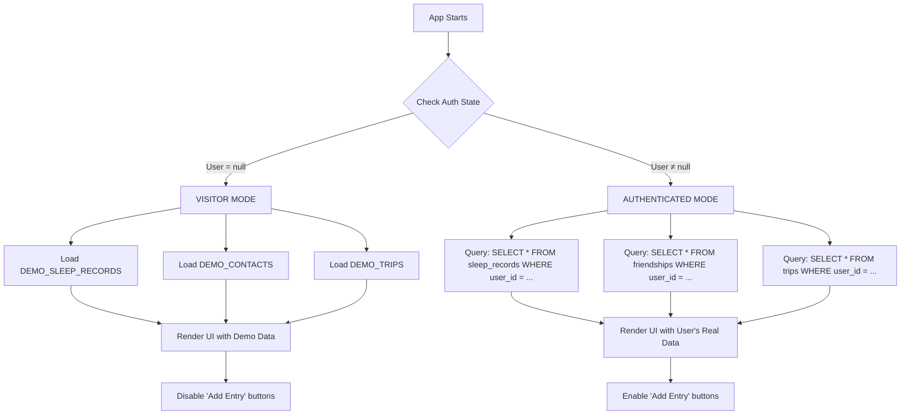

# STATS App: Dual-Mode Architecture

This document provides a quick reference for understanding the two operational modes of the STATS App.

---

## Quick Reference

### What are the two modes?

1. ** Visitor Mode** - Demo experience with sample data (no login required)
2. ** Authenticated Mode** - Personalized experience with Supabase backend

---

## When to Use Each Mode

### Visitor Mode

**Use this mode when:**
- Exploring the app for the first time
- Demonstrating features without real data
- Testing UI/UX without backend dependencies
- Working offline or without internet access
- Showcasing design and interaction patterns

**Characteristics:**
```
├─  No authentication required
├─  Static demo data (Jeffrey persona)
├─  Fully offline-capable
├─  Read-only interface
└─  Instant load (no network calls)
```

---

### Authenticated Mode

**Use this mode when:**
- Building a personal life tracking system
- Storing real data for long-term analytics
- Using social features (connections, comparisons)
- Leveraging AI-powered insights
- Syncing data across multiple devices

**Characteristics:**
```
├─  Email/password authentication (Supabase)
├─  PostgreSQL database (cloud-hosted)
├─  Full CRUD operations
├─  Row-Level Security (RLS)
├─  Multi-device sync
└─  AI analyst (Edge Functions)
```

---

## How Mode Detection Works



---

## Technical Implementation

### AuthContext (Core Decision Point)

```typescript
// contexts/AuthContext.tsx
const { user, session, loading } = useAuth()

// This is checked in every data hook
if (user) {
  //  AUTHENTICATED MODE
  fetchFromSupabase(user.id)
} else {
  //  VISITOR MODE
  loadDemoData()
}
```

### Data Fetching Hooks Pattern

All data hooks (`useHealthData`, `useSocialData`, etc.) follow this pattern:

```typescript
export function useHealthData() {
  const [data, setData] = useState([])
  const [isDemo, setIsDemo] = useState(false)

  useEffect(() => {
    async function fetchData() {
      const { data: { user } } = await supabase.auth.getUser()
      
      if (!user) {
        //  VISITOR MODE
        setData(DEMO_SLEEP_RECORDS)
        setIsDemo(true)
        return
      }

      //  AUTHENTICATED MODE
      const { data } = await supabase
        .from('sleep_records')
        .select('*')
        .eq('user_id', user.id)
      
      setData(data)
      setIsDemo(false)
    }
    
    fetchData()
  }, [])

  return { data, isDemo }
}
```

---

## Data Source Locations

### Visitor Mode Data

```
/data/
├── mockData.ts           # Main user profile (Jeffrey) containing health, social, finance
├── worldData.ts          # Travel data and friend trips
```

**Format:** TypeScript constants exported as arrays/objects

**Example:**
```typescript
export const DEMO_SLEEP_RECORDS: SleepRecord[] = [
  {
    id: "demo-1",
    date: "2026-01-05",
    duration: 480, // 8 hours
    quality: 85,
    deepSleep: 120,
    remSleep: 90
  },
  // ... 29 more records
]
```

---

### Authenticated Mode Data

```
Supabase PostgreSQL Database
├── auth.users              # Managed by Supabase Auth
├── public.profiles         # User metadata (username, avatar)
├── public.sleep_records    # Health data
├── public.sport_sessions   # Workouts
├── public.friendships      # Social connections
├── public.trips            # Travel history
└── public.assets           # Financial data
```

**Access:** Via Supabase client (`@supabase/supabase-js`)

**Example:**
```typescript
const { data, error } = await supabase
  .from('sleep_records')
  .select('*')
  .eq('user_id', user.id)  // RLS automatically enforces this
  .order('date', { ascending: false })
  .limit(30)
```

---

## Security Model

### Visitor Mode
- **No security concerns** - Demo data is hardcoded and public
- **No PII** - Fictional persona (Jeffrey)
- **No network calls** - Zero data transmission

### Authenticated Mode
- **RLS Policies** - Database enforces user data isolation
  ```sql
  CREATE POLICY "Users see only their data"
  ON sleep_records FOR SELECT
  USING (auth.uid() = user_id);
  ```
- **JWT Tokens** - Automatic expiration, auto-refresh
- **HTTPS/TLS** - All API calls encrypted
- **Password Hashing** - Bcrypt (managed by Supabase Auth)

---

## UI Indicators

### How Users Know Which Mode They're In

** Visitor Mode Indicators:**
- Avatar shows "jeffrey.jpg" (demo profile picture)
- Username displayed as "Jeffrey" or demo name
- Subtle badge: ` Viewing Demo Data`
- "Add Entry" buttons show tooltip: "Login to track your own data"
- Settings → Profile shows "Sign Up to Create Account"

** Authenticated Mode Indicators:**
- Avatar shows user's uploaded profile picture
- Username shows user's chosen username
- No demo badge
- "Add Entry" buttons fully functional
- Settings → Profile shows "Edit Profile" and "Sign Out"

---

## Performance Comparison

| Metric                  | Visitor Mode         | Authenticated Mode   |
|-------------------------|-------------------------|-------------------------|
| **Initial Load**        | ~200ms                  | ~400-800ms              |
| **Data Fetch**          | 0ms (in-memory)         | 200-500ms (network)     |
| **Offline Support**     | Full                  | Cached only          |
| **Network Dependency**  | None                  | Required             |
| **Bundle Impact**       | +50KB (demo data)       | +30KB (Supabase SDK)    |

---

## Migration Path: Visitor → Authenticated

When a user decides to create an account:

1. **User Intent:**
   - User clicks "Login to Save Changes" or "Create Account"
   - Navigated to `/login` page

2. **Authentication:**
   - User signs up with email/password
   - Supabase creates `auth.users` entry

3. **Onboarding:**
   - User redirected to `/onboarding`
   - Chooses username (unique constraint checked)
   - Uploads avatar (stored in Supabase Storage)
   - `profiles` table entry created

4. **Data Transition:**
   - App detects `user !== null`
   - All hooks switch from demo data to Supabase queries
   - Initial state: Empty database (user starts tracking)

5. **Future Enhancement:**
   - Option to "Import Demo Data" to pre-fill database
   - Allows users to start with sample entries and modify them

---

## Testing Both Modes

### Testing Visitor Mode
```bash
# 1. Clear local storage
localStorage.clear()

# 2. Remove Supabase env vars (optional)
# Comment out .env.local variables

# 3. Restart dev server
npm run dev

# 4. Verify demo data loads
# - Check that Jeffrey appears as profile
# - Verify 30 days of sleep data visible
# - Confirm "Add Entry" buttons are disabled
```

### Testing Authenticated Mode
```bash
# 1. Set up Supabase credentials
# Create .env.local with NEXT_PUBLIC_SUPABASE_URL and ANON_KEY

# 2. Run migrations
supabase db push

# 3. Sign up a test account
# Navigate to /login → Create account

# 4. Verify personal data isolation
# - Add a sleep entry
# - Check Supabase dashboard: user_id should match your account
# - Sign up second account: should not see first account's data
```

---

## Related Documentation

- **[ARCHITECTURE.md](./ARCHITECTURE.md)** - Complete technical architecture with database schema
- **[README.md](./README.md)** - Project overview, modules, getting started guide
- **[CONTRIBUTING.md](./CONTRIBUTING.md)** - Development guidelines (if exists)

---

## FAQ

### Q: Can I switch modes without losing data?
**A:** Visitor mode has no persistent data to lose. In Authenticated mode, your data is safely stored in Supabase and will persist across sessions.

### Q: Do I need a Supabase account to run the app?
**A:** No! The app runs perfectly in Visitor Mode without any backend. Supabase is only needed for the Authenticated Mode.

### Q: Can I export my data from Authenticated Mode?
**A:** Yes, GDPR compliance features are planned. You'll be able to export all your data as JSON and request account deletion.

### Q: Is the demo data representative of real usage?
**A:** Yes! The demo data (Jeffrey persona) contains 30 days of realistic health data, travel history, social connections, and financial metrics to showcase the full UI.

### Q: How does the app decide which mode to use?
**A:** The `AuthContext` checks `supabase.auth.getUser()` on mount. If a valid session exists, Authenticated Mode is used. Otherwise, Visitor Mode is activated automatically.

### Q: Can I contribute demo data for Visitor Mode?
**A:** Absolutely! Demo data is stored in `/data/*.ts` files. You can create more diverse personas or scenarios for testing.

---

**Last Updated:** 2026-01-06  
**Version:** 1.0 (Dual-Mode Architecture)
